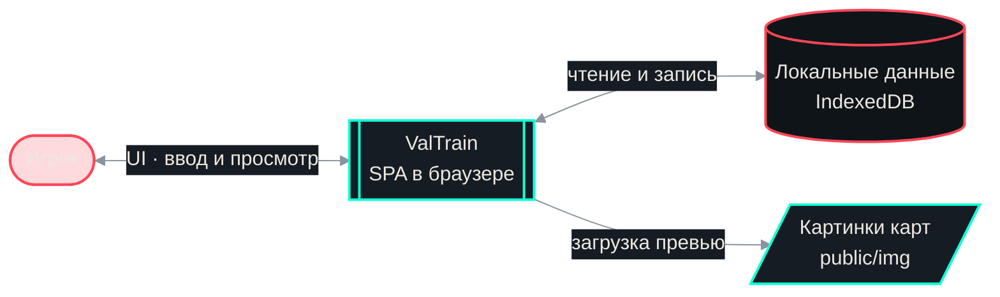
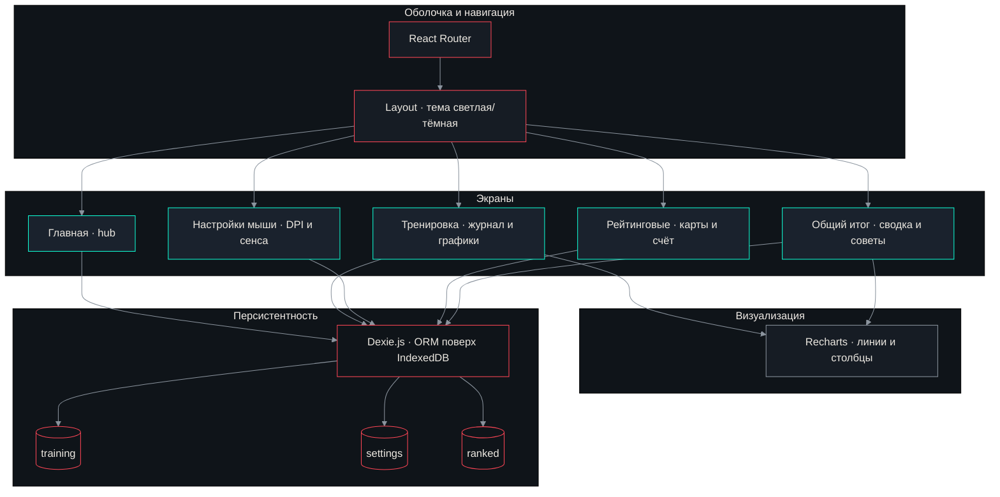
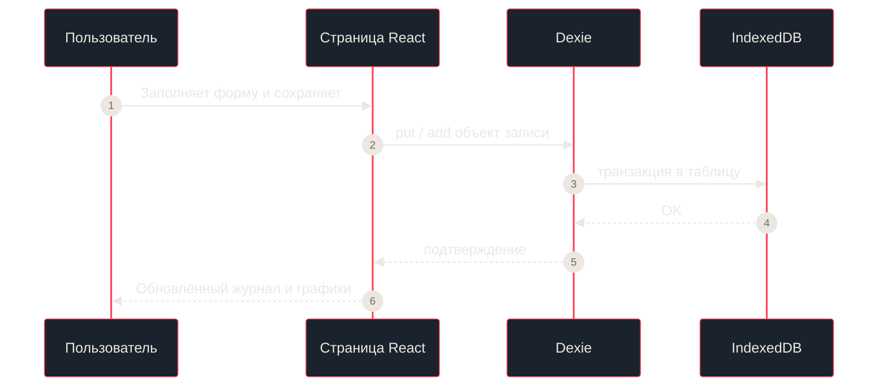

# ValTrain

Журнал тренировок и матчей для **Valorant**: подходы на тренировках, настройки мыши, рейтинговые игры и отчёты — всё работает в браузере, данные хранятся **локально** (IndexedDB).

---

## Возможности

| Раздел | Описание |
|--------|----------|
| **Тренировка** | «100 ботов» с последовательными подходами, сложные боты (сложность + результат из 30), Deathmatch (kills/deaths, оружие), фильтр по датам, графики и краткие наблюдения |
| **Настройки** | DPI, чувствительность прицела, множители scoped и ADS — слайдеры и точный ввод с клавиатуры, eDPI |
| **Рейтинговые** | Карты с превью из `public/img/`, K/D/A, **счёт матча** (подсветка победа / поражение / ничья), история |
| **Общий итог** | Сводка за период, рекомендации, карты по K/D, те же графики тренировок |

Дополнительно: **светлая и тёмная тема** с плавным переключением, оформление в духе тактического минимализма Valorant.

---

## Схема работы (IDEF-подобная декомпозиция)

Ниже — двухуровневая логика в духе **IDEF0**: сначала контекст «кто с чем взаимодействует», затем разбиение приложения на навигацию, экраны, визуализацию и хранение данных. Диаграммы на [Mermaid](https://mermaid.js.org/) — на GitHub они отображаются прямо в файле.

### Уровень A-0: контекст системы



### Уровень A1: декомпозиция приложения



### Поток данных при сохранении записи



---

## Быстрый старт

Требуется **Node.js** 18+ и npm.

```bash
git clone https://github.com/LabbyX/ValTrain.git
cd ValTrain
npm install
npm run dev
```

Откройте в браузере адрес из терминала (обычно `http://localhost:5173`).

### Сборка для продакшена

```bash
npm run build
npm run preview
```

Папка **`dist/`** — статика для любого хостинга (GitHub Pages, Netlify, Vercel и т.д.).

---

## Картинки карт

Файлы лежат в **`public/img/`**. Пути задаются в [`src/data/valorant.ts`](src/data/valorant.ts) в поле `image` (например `/img/ascent.jpg`). Имя и расширение должны совпадать с реальным файлом.

---

## Стек

- [React 18](https://react.dev/) + [TypeScript](https://www.typescriptlang.org/)
- [Vite](https://vitejs.dev/)
- [React Router](https://reactrouter.com/)
- [Dexie.js](https://dexie.org/) (IndexedDB)
- [Recharts](https://recharts.org/)

---

## Данные и приватность

Все записи тренировок, настройки и рейтинговые строки хранятся **только на вашем устройстве** в браузере. Очистка данных сайта или другой браузер означает пустую базу — при необходимости делайте резервные копии вручную (экспорт в приложении можно добавить отдельно).

---

## Лицензия

MIT — см. файл [`LICENSE`](LICENSE).

---

<p align="center">
  <sub>Не связано с Riot Games. Valorant — торговая марка Riot Games, Inc.</sub>
</p>
